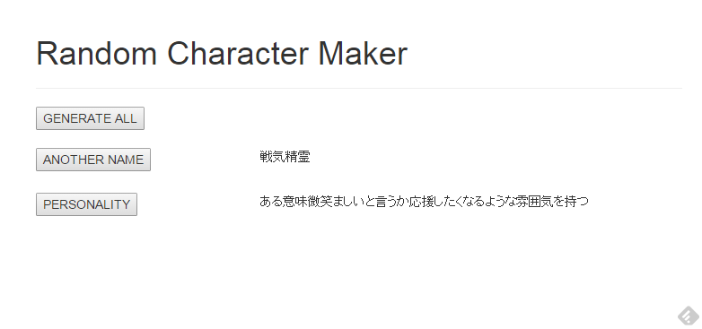

TRPG Random Generator
===

Random generator for TRPG. (sorry, Japanese version only)

This is my practice application for phalcon2 php framework :)

## Requestments

- PHP 5.6.x
    - Phalcon php framework 2.0.7
- MySQL 5.6.x

## External Links

[Phalcon - High Performance PHP Framework](https://phalconphp.com/)

## Road Map

- Fantasy player name generator [done]
- Fantasy player personality generator [done]
- Fantasy Sword World 2.0 generator [inprogress]

## Refactoring Point

- table name is too long => master_は不要
- table column name 'category' and 'type' are same roll => 統一したい